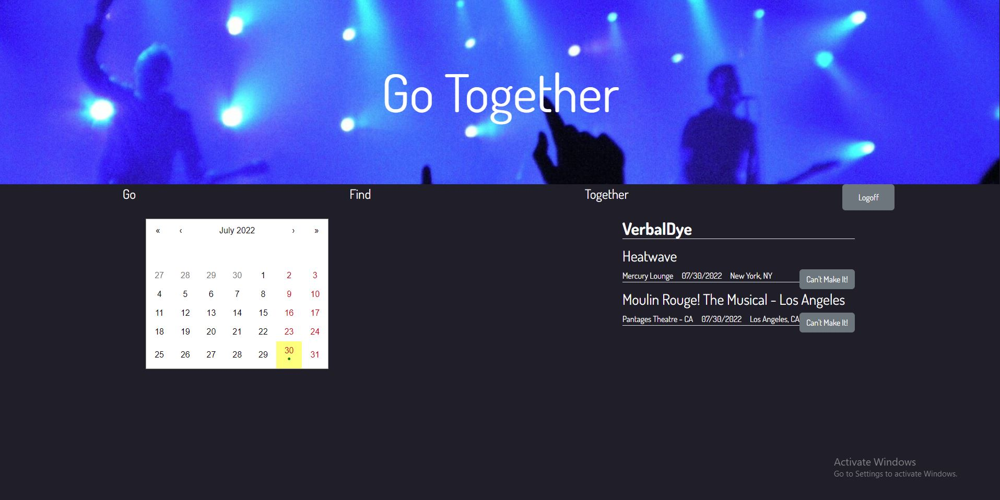

  # Go-Together

  ## Description
  This is social media and event tracking app designed to make it easier to find, keep track of, and share events with your friends. The project uses the MERN stack as well as Apollo and GraphQL.

  ## Table of Contents
  - [Contributing](#contributing)
  - [Deployed](#deployed)
  - [Questions](#questions)

  ## Contributing
  Contact us at dhunts258@gmail.com

  ## Screenshot
  

  ## Deployed
  [Click Me!](https://go-together.fly.dev/#/)

  ## Questions?
  If you have any more questions for me, I can be reached from one of the links below. Thank you!
  - [Email Me!](mailto:dhunts258@gmail.com)
  - [Visit me on Github!](https://github.com/Meshuganah)
